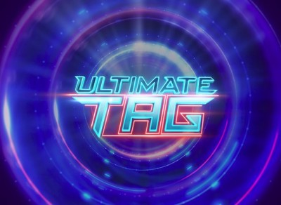

# Ultimate Tag: Death-Match '83, Beyond Thunderdome

Welcome to *Ultimate Tag: Death-Match '83, Beyond Thunderdome*!

Are you ready for the most epic and inspired game of tag of your entire life?!

Well, you should be!

The objective of *Ultimate Tag* is an age-old one that transcends not only the modern school playground, but also every neighbourhood yard of ye ol' suburb. It is an objective that reaches beyond its Platonic form, stretching out from the grasping reaches of the metaphysical and the logical. It is an objective that defines not only humankind but sits at the basis of all actions, rational and irrational. Indeed, it is an objective that defines 42; an objective that defines existence and meaning itself!

That objective, of course, is to not be *it*. And if you are *it*, you damn well better un-*it* yourself as quickly as you can!

## Mechanics

*Ultimate Tag* has the following core mechanics:

1) You start as the player on the left
2) You move with the arrow keys
3) The player who is red is *it*
4) Green orbs are a 1.25x speed powerup
5) Blue orbs are a 2x speed powerup

## Compilation and Running the Game

A Makefile has been provided for those on a Linux machine, though this might work on Windows. This Makefile has two dependencies: `dasm` and `stella`.

To compile the program, simply type `make`. To run the game, type `make run`. To remove the compiled binary, type `make clean`.

For those on other operating systems, compilation should be done with the following command, in however way it must be done there (such as running the compiler from the same directory as this project): `dasm ultimate_tag.asm -f3 -oultimate_tag.atari -Iheaders`.

The file to run in the emulator is then `ultimate_tag.atari`.

[Github link.](https://github.com/scott-parkhill/ultimate-tag)
